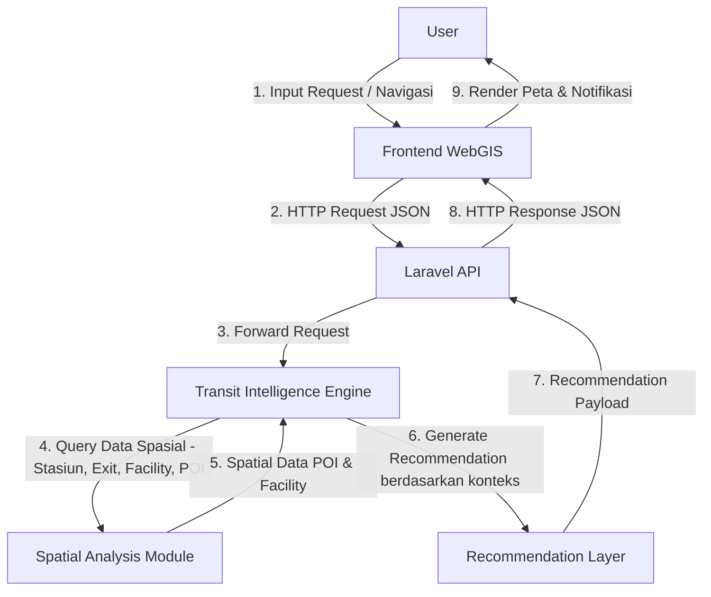
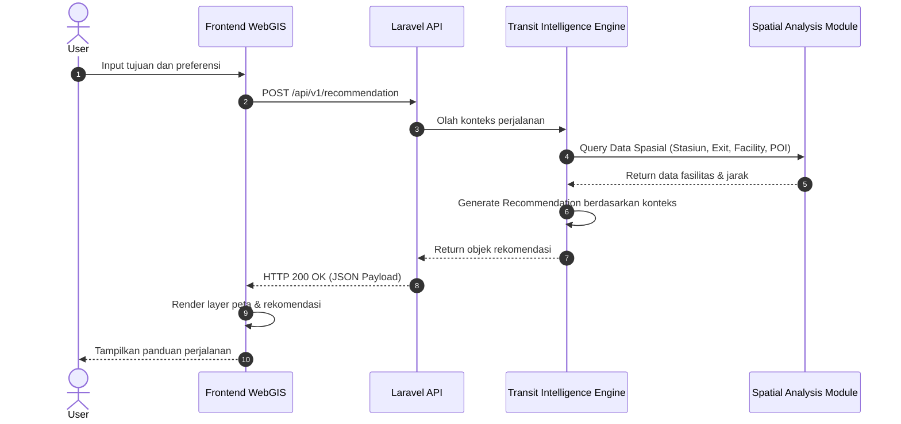

# 🚆 MAPID Transit Intelligence
### Beyond Navigation, Towards Intelligent Public Transportation

---

## 📖 Overview

MAPID Transit Intelligence merupakan platform WebGIS yang dirancang untuk meningkatkan pengalaman pengguna transportasi umum melalui pemanfaatan data spasial, rekomendasi cerdas, serta informasi perjalanan yang kontekstual.

Berbeda dengan aplikasi navigasi konvensional yang hanya berfokus pada pencarian rute tercepat, MAPID berfokus pada **bagaimana pengguna dapat menjalani perjalanan dengan lebih nyaman, efisien, dan percaya diri**.

MAPID mendampingi pengguna mulai dari sebelum keberangkatan hingga tiba di tujuan dengan memberikan rekomendasi berdasarkan kondisi perjalanan yang sedang berlangsung.

---

## 🎯 Vision

> Membantu masyarakat menggunakan transportasi umum dengan pengalaman perjalanan yang lebih nyaman, efisien, dan informatif melalui pemanfaatan WebGIS dan Transit Intelligence.

---

## ❗ Background & Problem Statement

Saat ini aplikasi navigasi seperti Google Maps mampu membantu pengguna menemukan rute menuju tujuan. Namun masih terdapat berbagai permasalahan selama proses perjalanan berlangsung:

| No | Permasalahan |
|----|--------------|
| 1  | Pengguna tidak mengetahui fasilitas yang tersedia pada stasiun atau halte |
| 2  | Pengguna terlambat turun dari kendaraan |
| 3  | Pengguna salah memilih gerbong sehingga harus berjalan lebih jauh |
| 4  | Pengguna bingung saat melakukan transit antar moda |
| 5  | Pengguna tidak mengetahui pintu keluar terbaik menuju tujuan |
| 6  | Pengguna harus berjalan lebih jauh akibat salah memilih posisi naik |

Permasalahan-permasalahan tersebut belum sepenuhnya dijawab oleh aplikasi navigasi konvensional.

---

## 💡 Solution

MAPID menghadirkan konsep **Transit Intelligence** — sistem rekomendasi perjalanan yang memanfaatkan data spasial, kondisi perjalanan, serta informasi transportasi untuk membantu pengguna mengambil keputusan terbaik selama perjalanan.

**MAPID bukan menggantikan navigasi. MAPID menjadi pendamping perjalanan pengguna.**

---

## 🧠 Core Concept

| | Google Maps | MAPID Transit Intelligence |
|--|-------------|---------------------------|
| Pertanyaan yang dijawab | *"Bagaimana cara menuju tujuan?"* | *"Bagaimana menjalani perjalanan dengan cara yang paling nyaman?"* |
| Fokus | Rute tercepat | Kenyamanan selama perjalanan |
| Peran | Navigasi | Pendamping perjalanan |
| Data utama | Jalan & rute | Spasial, fasilitas, & kondisi real-time |

Perbedaan utama tersebut menjadi dasar seluruh fitur MAPID.

---

## 🗺 WebGIS as The Core

Seluruh sistem dibangun di atas **data spasial**. Data spasial yang dikelola meliputi:

**Infrastruktur Transportasi**
- Lokasi halte & stasiun
- Jalur transportasi
- Titik transit antar moda

**Fasilitas Stasiun**
- Pintu keluar (exit gate)
- Lift & eskalator
- Mushola & toilet
- ATM & area aksesibilitas
- Tenant komersial

**Prinsip utama:**
> AI tidak membuat data. AI hanya memanfaatkan data yang tersedia.

---

## 🏢 Station Profile

Setiap halte maupun stasiun memiliki halaman informasi yang berisi seluruh **Point of Interest (POI)**.

### Public Facilities
- Toilet
- Mushola
- Lift
- Escalator
- Nursery Room
- Charging Station

### Commercial Facilities
- Indomaret
- Lawson
- Roti O
- Kopi Kenangan
- ATM

### Accessibility
- Wheelchair Access
- Guiding Block
- Elevator
- Priority Route

Setiap fasilitas memiliki atribut tambahan:

| Atribut | Keterangan |
|---------|------------|
| Lokasi | Koordinat spasial |
| Lantai | Posisi vertikal dalam gedung |
| Posisi Relatif | Relatif terhadap pintu masuk / exit |
| Jam Operasional | Waktu buka & tutup |
| Status Operasional | Aktif / Maintenance / Tutup |

---

## 📍 Spatial Database Schema

Seluruh informasi disimpan dalam **Spatial Database** (PostgreSQL + PostGIS).

Skema data tiap fasilitas:

| Field | Type | Keterangan |
|-------|------|------------|
| `facility_name` | VARCHAR | Nama fasilitas |
| `category` | ENUM | Jenis fasilitas (public/commercial/accessibility) |
| `coordinate` | GEOMETRY(Point) | Koordinat GPS |
| `floor` | INT | Lantai lokasi |
| `nearest_exit` | FK | Referensi ke exit terdekat |
| `nearest_escalator` | FK | Referensi ke eskalator terdekat |
| `nearest_lift` | FK | Referensi ke lift terdekat |
| `operating_hours` | JSONB | Jadwal operasional |
| `status` | ENUM | active / maintenance / closed |
| `last_update` | TIMESTAMP | Waktu update terakhir |

---

## 🔄 Dynamic Information

Selain data statis, MAPID juga mengelola **informasi dinamis** yang dapat berubah sewaktu-waktu.

Contoh kondisi dinamis:
- 🟡 Lift sedang maintenance
- 🔴 Tenant tutup sementara
- 🔴 Toilet ditutup
- 🔴 Exit tertentu ditutup
- 🟡 Eskalator rusak

Sumber informasi dinamis:
- **Operator transportasi** (resmi)
- **Administrator** MAPID
- **Community Report** (laporan pengguna)

---

## 🚉 User Journey

Perjalanan pengguna dibagi menjadi **9 tahap**, dan sistem memberikan rekomendasi berbeda di setiap tahap.

```
1. Perencanaan perjalanan
   └── Pengguna memilih tujuan

2. Persiapan keberangkatan
   └── Sistem memberikan rekomendasi awal

3. Perjalanan menuju halte
   └── Panduan navigasi menuju titik naik

4. Naik transportasi
   └── Rekomendasi gerbong & posisi naik

5. Transit
   └── Panduan perpindahan moda

6. Mendekati tujuan
   └── Arrival reminder aktif

7. Turun
   └── Konfirmasi stasiun tujuan

8. Keluar stasiun
   └── Rekomendasi exit gate terbaik

9. Menuju destinasi akhir
   └── Panduan dari exit ke tujuan akhir
```

---

## 🚀 Core Features

| Fitur | Deskripsi |
|-------|-----------|
| **Smart Route Planning** | Perencanaan rute cerdas berbasis data spasial |
| **Station Profile** | Profil lengkap stasiun & halte beserta POI |
| **Boarding Recommendation** | Rekomendasi gerbong & posisi naik terbaik |
| **Arrival Reminder** | Notifikasi mendekati stasiun tujuan |
| **Transfer Assistant** | Panduan transit antar moda transportasi |
| **Facility Finder** | Pencarian fasilitas terdekat di dalam stasiun |
| **Exit Recommendation** | Rekomendasi pintu keluar menuju tujuan |
| **Journey Timeline** | Ringkasan perjalanan dari awal hingga akhir |
| **Live Station Status** | Status fasilitas & kondisi stasiun real-time |

---

## 🟢 Live Station Status

Sistem menampilkan kondisi terkini setiap fasilitas secara real-time.

Contoh tampilan status:

```
🟢 Toilet        → Tersedia
🟡 Lift          → Maintenance
🔴 Exit Barat    → Ditutup
🟢 Mushola       → Tersedia
🟢 Roti O        → Buka
```

Sumber data status: **database + operator + laporan komunitas**

---

## 🧭 Facility Finder

Pengguna dapat mencari fasilitas berdasarkan kebutuhan. Contoh alur:

```
Input: "Cari Toilet"
         ↓
Sistem query PostGIS ST_DWithin dari posisi pengguna
         ↓
Output:
  - Nama fasilitas
  - Lantai
  - Pintu keluar terdekat
  - Estimasi waktu berjalan kaki
```

---

## 📈 Why Transit Intelligence?

```
Google Maps   →  membantu pengguna menemukan jalan
MAPID         →  membantu pengguna menjalani perjalanan
```

MAPID tidak berusaha menggantikan navigasi. Sebaliknya, MAPID **meningkatkan pengalaman pengguna** selama proses perjalanan berlangsung — mulai dari memilih gerbong yang tepat, menemukan fasilitas, hingga keluar dari stasiun dengan efisien.

---

## 🏗 High-Level System Architecture

```
                        User
                          │
                          ▼
                   Route Planning
                          │
                          ▼
              Spatial Database
           (Station, POI, Facility)
                          │
                          ▼
          Transit Intelligence Engine
                          │
                          ▼
             Recommendation Layer
                          │
                          ▼
                  User Interface
                  (Frontend WebGIS)
```

---

## 🔌 Integrasi Sistem

### A. Integrasi Data (Backend-to-Backend)

Akses data MAPID Apps (Properti Go, Menu Go, Struk Go, & Activities) dilakukan secara **Backend-to-Backend (B2B)** menggunakan otentikasi `x-api-key` pada header request.

```
DB/Storage  ←──DB/Storage Connections──→  BACKEND  ←──HTTP Restful API──→  FRONTEND
                                               ↑
                                     HTTP Restful API
                                               │
                                           BE MAPID
```

### B. Integrasi Basemap (Frontend Direct)

Integrasi dengan basemap **MAPID Maps** dapat dilakukan secara langsung dari sisi frontend. Pendekatan ini memberikan keunggulan **latency yang sangat rendah** karena request langsung ditujukan ke server vector tile MAPID.

```
DB/Storage  ←──DB/Storage Connections──→  BACKEND  ←──HTTP Restful API──→  FRONTEND
                                                                                 │
                                                                       HTTP Restful API
                                                                                 │
                                                                           MAPID Maps
```

> **Catatan:** Key yang diberikan saat ini berfungsi sebagai identifier hitungan penggunaan (usage counting). Fitur pembatasan domain (domain list) belum tersedia.

### C. Arsitektur Proxy Pass (Opsional)

Jika ingin menyembunyikan API key, dapat menggunakan jalur **Proxy Pass via backend**.

```
DB/Storage  ←──DB/Storage Connections──→  BACKEND  ←──HTTP Restful API──→  FRONTEND
                                               │
                                     HTTP Restful API
                                               │
                                           MAPID Maps
```

> **Catatan Arsitektur:** Pendekatan proxy pass akan **menambah latency** dan berpotensi menurunkan kualitas User Experience (UX). Pastikan server backend memiliki spesifikasi tinggi untuk menangani high-throughput requests.

---

## 🔄 End-to-End Diagram

### Flowchart End-to-End



### Sequence Diagram



---

## 🧩 Penjelasan Komponen Sistem

| Komponen | Teknologi | Peran |
|----------|-----------|-------|
| **User** | — | Menginput pencarian rute, preferensi fasilitas, atau meminta bantuan rute transit |
| **Frontend WebGIS** | Leaflet / MapLibre | UI peta interaktif yang menangkap lokasi & preferensi user |
| **Laravel API** | Laravel (PHP) | REST API Gateway untuk autentikasi, validasi, dan routing request |
| **Transit Intelligence Engine** | — | Engine logika yang mengevaluasi kondisi perjalanan dan menghasilkan rekomendasi |
| **Spatial Analysis Module** | PostgreSQL + PostGIS | Pemrosesan spasial menggunakan `ST_DWithin` dan `ST_Distance` untuk query stasiun, exit, facility, dan POI |
| **Recommendation Layer** | — | Menghasilkan rekomendasi kontekstual: gerbong ideal, exit gate terdekat, reminder kedatangan |

---

## 📚 Data Sources

Seluruh rekomendasi berasal dari data yang dapat dipertanggungjawabkan:

| Sumber | Jenis Data |
|--------|------------|
| **OpenStreetMap** | Peta dasar, jaringan jalan, POI publik |
| **GTFS** | Jadwal & rute transportasi umum (statis) |
| **GTFS Realtime** | Posisi kendaraan & keterlambatan (dinamis) |
| **MAPID Survey** | Data fasilitas hasil survei lapangan tim MAPID |
| **Operator Transport Data** | Data resmi dari operator transportasi |
| **Community Report** | Laporan kondisi dari pengguna |

---

## 🎯 Scope MVP (Hackathon)

Versi MVP Hackathon berfokus pada fitur yang dapat diimplementasikan secara realistis:

### ✅ Fitur MVP
- Smart Route Planning
- Station Profile
- Boarding Recommendation
- Arrival Reminder
- Transfer Assistant
- Facility Finder
- Live Station Status

### 🗓 Roadmap Berikutnya
- AI Prediction
- Crowd Forecasting
- Personalized Recommendation
- Advanced Analytics

---

## 🛠 Tech Stack Summary

| Layer | Teknologi |
|-------|-----------|
| Frontend | Leaflet / MapLibre GL JS |
| Backend API | Laravel (PHP) |
| Database | PostgreSQL + PostGIS |
| Spatial Query | `ST_DWithin`, `ST_Distance`, `ST_AsGeoJSON` |
| Basemap | MAPID Maps (Vector Tile) |
| Data Format | GeoJSON, GTFS, GTFS-RT |
| Auth | x-api-key (B2B), JWT (user) |

---

*Dokumen ini merupakan spesifikasi lengkap sistem MAPID Transit Intelligence, mencakup product brief, arsitektur teknis, diagram alur, dan scope implementasi MVP.*
