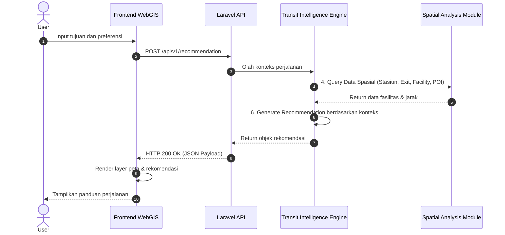

# 🚆 MAPID Transit Intelligence - End-to-End Diagram (Revisi)

Dokumen ini berisi diagram alur sistem **MAPID Transit Intelligence** yang telah diperbarui sesuai revisi terbaru.

---

## 1. Flowchart End-to-End

```mermaid
graph TD
    A[User] -->|1. Input Request / Navigasi| B[Frontend WebGIS]
    B -->|2. HTTP Request JSON| C[Laravel API]
    C -->|3. Forward Request| D[Transit Intelligence Engine]
    D -->|4. Query Data Spasial (Stasiun, Exit, Facility, POI)| E[Spatial Analysis Module]
    E -->|5. Spatial Data POI & Facility| D
    D -->|6. Generate Recommendation berdasarkan konteks| F[Recommendation Layer]
    F -->|7. Recommendation Payload| C
    C -->|8. HTTP Response JSON| B
    B -->|9. Render Peta & Notifikasi| A
```

---

## 2. Sequence Diagram



---

## 3. Penjelasan Ringkas Komponen

1. **User**: Menginput pencarian rute, preferensi fasilitas, atau meminta bantuan rute transit.
2. **Frontend WebGIS**: UI Peta interaktif (Leaflet/MapLibre) yang menangkap lokasi & preferensi user.
3. **Laravel API**: REST API Gateway untuk autentikasi, validasi, dan rute request.
4. **Transit Intelligence Engine**: Engine logika yang mengevaluasi kondisi perjalanan.
5. **Spatial Analysis Module**: Modul pemrosesan spasial PostgreSQL + PostGIS (`ST_DWithin`, `ST_Distance`) untuk Query Data Spasial (Stasiun, Exit, Facility, POI).
6. **Recommendation Layer**: Menghasilkan rekomendasi berdasarkan konteks (gerbong ideal, exit gate terdekat, reminder kedatangan).
